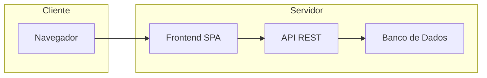

# 💰 Organizador Financeiro Pessoal

> **Aplicação em produção:** [🔗 Acessar aplicação](https://nossonegocio.app)  
> *(Ou use o link completo da sua aplicação, se for diferente)*

Sistema de gestão financeira pessoal focado em simplicidade e boa experiência do usuário. Desenvolvido como MVP para controle de receitas, despesas, metas de poupança e materiais personalizados por cliente.

---

## 📸 Demonstração

*Inclua aqui screenshots ou GIFs da interface para mostrar o produto em uso.*

| Dashboard | Transações | Configuração mensal |
|-----------|------------|---------------------|
| *(screenshot)* | *(screenshot)* | *(screenshot)* |

---

## ✨ O que o sistema oferece

### Para o usuário final
- **Dashboard** com resumo financeiro mensal, gráficos (despesas por categoria, evolução de gastos, comparativo mensal) e lista de transações recentes.
- **Gestão de transações**: adicionar, editar e excluir despesas; filtros por categoria, mês, ano e busca por descrição; paginação e exportação para CSV.
- **Configuração mensal**: definição de receita e meta de poupança (fixa ou percentual), com cálculo automático da sobra disponível.
- **Materiais personalizados**: visualização de PDFs e vídeos enviados pelo administrador, com download e visualizador integrado no navegador.

### Para o administrador
- Dashboard com estatísticas, gerenciamento de clientes, upload de materiais por cliente e envio automático de e-mail de boas-vindas.

### Segurança e conformidade
- Autenticação com tokens JWT, recuperação e troca de senha, multi-tenancy lógico (dados isolados por usuário), sem cadastro público.

---

## 🏗️ Arquitetura (visão geral)

Fluxo de dados em alto nível — sem expor detalhes de implementação:

- **Frontend:** aplicação single-page (SPA) que consome uma API REST.
- **Backend:** API REST com autenticação por token; dados persistidos em banco relacional.
- **Infraestrutura:** aplicação containerizada; em produção, servidor web na frente da SPA e da API.

---

## 🛠️ Stack tecnológica

| Camada | Tecnologias |
|--------|-------------|
| **Frontend** | React, Vite, Tailwind CSS, React Router, Recharts, Axios |
| **Backend** | Django, Django REST Framework, autenticação JWT |
| **Banco de dados** | PostgreSQL |
| **Infraestrutura** | Docker, Docker Compose, Nginx (produção) |
| **E-mail** | Integração com serviço de e-mail (ex.: SMTP ou provedor em nuvem) |

---

## 📡 API — visão geral

A API é RESTful e organizada por domínio. A documentação abaixo descreve **o que** cada área faz, não a implementação interna.

| Área | Função |
|------|--------|
| **Autenticação** | Login, refresh de token, recuperação de senha, troca de senha. |
| **Financeiro** | CRUD de transações, configuração mensal (receita/meta), categorias, listagens com filtros e exportação. |
| **Admin** | Gestão de usuários/clientes e de materiais por cliente. |

*Para integrações, pode-se expor apenas documentação de contratos (ex.: request/response de exemplo) sem revelar regras de negócio internas.*

---

## 🧩 Desafios técnicos abordados

- Multi-tenancy lógico com isolamento rigoroso de dados por usuário.
- Experiência fluida no frontend (modais, filtros, paginação, gráficos) mantendo a API como única fonte de verdade.
- Gestão de sessão e segurança (JWT, CORS, validação server-side).
- Upload, armazenamento e entrega de mídia (PDF/vídeo) com controle de acesso.
- Automação de e-mails (boas-vindas, recuperação de senha) integrada ao fluxo do produto.
- Deploy containerizado com separação entre frontend, API e banco, preparado para ambiente de produção.

---

## 📋 Checklist antes de tornar qualquer repositório público

Certifique-se de que **nunca** são versionados:

| Categoria | O que não expor |
|-----------|------------------|
| **Credenciais** | `.env`, chaves de API, senhas de banco |
| **Dependências** | `node_modules/`, `venv/`, `__pycache__/` |
| **Build e logs** | `dist/`, `build/`, logs com caminhos ou dados sensíveis |
| **Certificados** | Chaves SSL, certificados privados |

Use um **.gitignore** consistente e, se for abrir um repositório que já foi privado, prefira criar um repositório novo “limpo” em vez de tornar o histórico antigo público.

---

**Última atualização:** Março 2025
